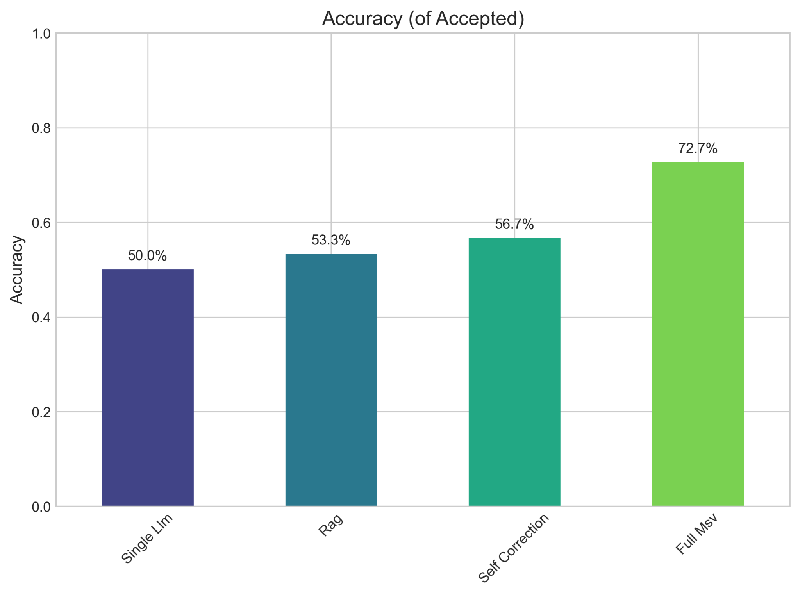
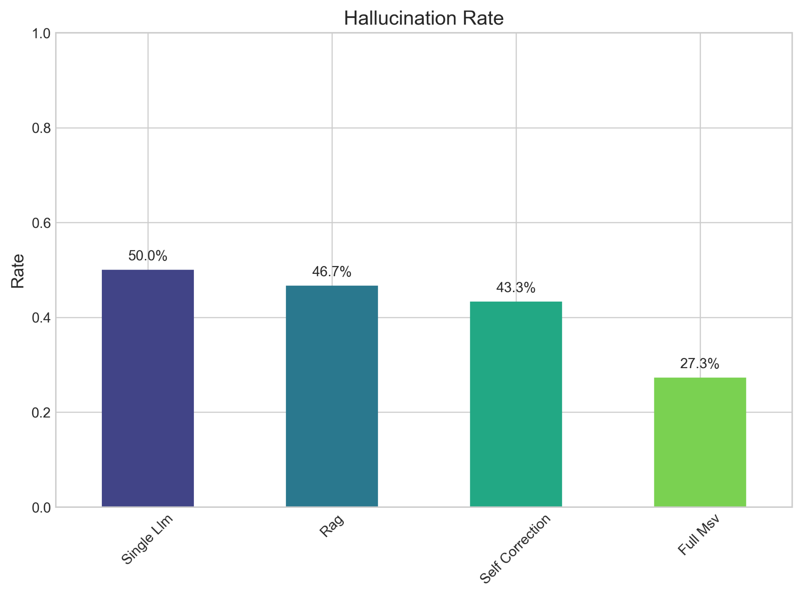
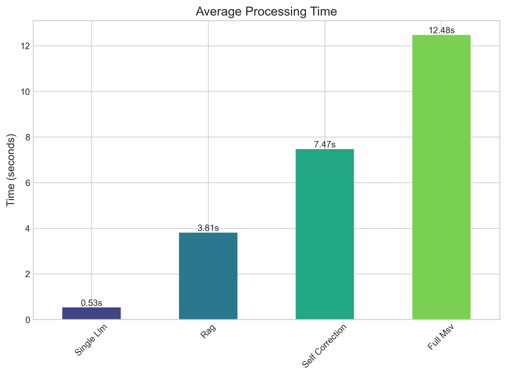
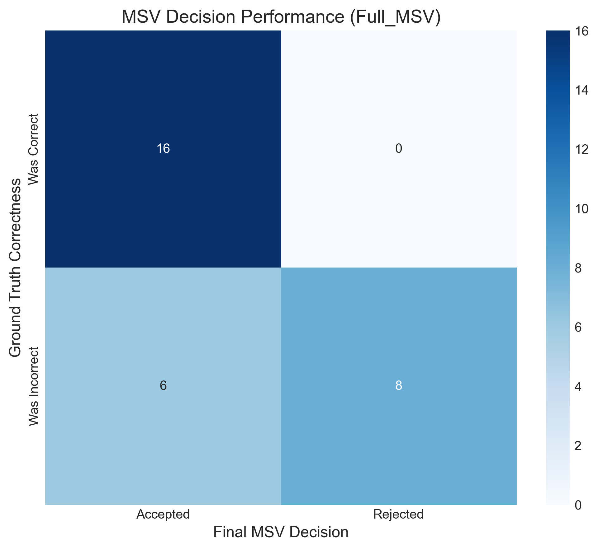
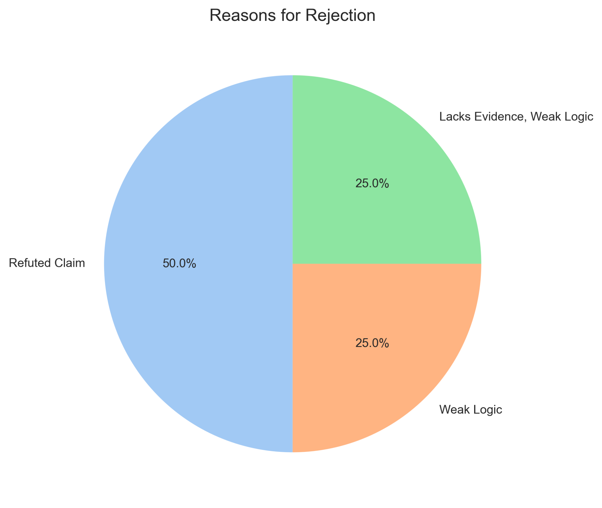

# Multi-Agent Cross-Verification (MACV) Framework

## About The Project

Large language models (LLMs) like GPT-4, PaLM, and LLaMA are powerful tools for generating human-like text. However, they are prone to producing "hallucinations"—false or misleading information—which limits their reliability in sensitive domains like healthcare, law, and finance.

The **Multi-Agent Cross-Verification (MACV) framework** is designed to address this challenge by using a team of specialized AI agents to scrutinize and validate the output of a primary LLM. This collaborative approach significantly reduces the risk of hallucinations and increases the trustworthiness of AI-generated responses.

### How It Works

The framework follows a structured verification workflow:

1.  **Primary Response Generator (PRG)**: Generates an initial answer to a given prompt.
2.  **Fact-Checking Agent (FCA)**: Verifies factual claims against external knowledge sources like Wikipedia and PubMed.
3.  **Domain-Specific Validator (DSV)**: Ensures technical accuracy within specialized fields (e.g., finance, science) using curated datasets.
4.  **Adversarial Tester (AT)**: Probes the initial response for logical contradictions and reasoning flaws.
5.  **Consensus Mechanism**: Aggregates the findings from all agents to produce a final, verified answer or abstain if the response cannot be trusted.

This multi-layered approach ensures that the final output is robust, reliable, and factually accurate.

```
+--------------------+
|  PRG (Generator)   |───┐
+--------------------+   │  Draft answer + claims
                         │
               ┌─────────▼─────────┐
               │   Orchestrator    │  (timeouts, early exit)
               └─────────┬─────────┘
      ┌──────────────────┼──────────────────┐
      ▼                  ▼                  ▼
 +-----------+     +------------+      +--------------+
 |  FCA      |     |  DSV       |      |     AT       |
 | fact‑check|     | domain DB  |      | stress tests |
 +-----------+     +------------+      +--------------+
      │                   │                    │
      └───────────┬───────┴───────────┬────────┘
                  ▼                   ▼
           +----------------------------------+
           |  Consensus (claim → answer)      |
           |  DS/GLAD-weighted + rules        |
           +-------------------┬--------------+
                               ▼
                     Final: ACCEPT/REJECT
```
## Getting Started

Follow these steps to set up the project locally.

### Prerequisites

* Python 3.8+
* An OpenAI API key
* A Tavily AI API key for the Fact-Checking Agent

### Installation

1.  **Clone the repository:**
    ```sh
    git clone https://github.com/nilayvarma1005/macv_framework.git
    cd macv-framework
    ```

2.  **Create a virtual environment:**
    ```sh
    python -m venv venv
    source venv/bin/activate  # On Windows, use `venv\Scripts\activate`
    ```

3.  **Install the required packages:**
    ```sh
    pip install -r requirements.txt
    ```

4.  **Set up your environment variables:**
    Create a `.env` file in the project root and add your API keys:
    ```
    OPENAI_API_KEY="your-openai-api-key"
    TAVILY_API_KEY="your-tavily-api-key"
    ```

## Usage

To run the full evaluation pipeline and reproduce the results, execute the main script:

```sh
python main.py

## Sample figures

<p align="center">
  
</p>

<p align="center">
  
</p>

<p align="center">
  
</p>

<p align="center">
  
</p>

<p align="center">
  
</p>

---
